# AI Product Discover / 智研产品发现 Agent

AI Product Discover / 智研产品发现 Agent 是一个面向 AI 产品经理、创业者、独立开发者和咨询顾问的产品发现 MVP。

它的目标是把一个产品想法转化为结构化的产品发现结果：需求澄清、研究计划、竞品分析、用户画像、MVP PRD、页面结构、评测打分、Trace 和导出内容。

当前版本默认使用 Mock LLM 和 Mock Search，保证没有 API Key 也能本地跑通完整流程。DeepSeek Provider、OpenAI Provider 和通用 Search Provider 的代码结构已经预留，但默认不启用。

## 当前版本进展

- 前端工作台支持由用户逐步触发产品发现步骤，避免一次运行完整链路造成长时间等待。
- 产品发现链路已覆盖目标用户、场景与问题、需求澄清、研究计划、行业市场、竞品识别、竞品分析表、用户画像和 MVP PRD。
- 行业市场、竞品识别和竞品分析表支持 `fact`、`inference`、`assumption` 三层证据标记。
- 五维评测覆盖完整性、可信度、差异化、可开发性和表达清晰度。
- 评测结果可根据可信度和差异化缺口建议补充研究，最多执行两轮搜索，再由用户触发重新评测。

## 核心功能

- 产品想法输入
- 需求澄清
- 研究计划
- Mock 搜索、多轮补充研究与证据摘要
- 行业与市场初步分析
- 竞品识别与竞品分析表
- 事实 / 推断 / 假设分层
- 用户画像
- MVP PRD
- 页面结构
- 五维评测打分与研究闭环
- Agent Trace
- Markdown / JSON / Mermaid 导出
- Prisma SQLite 持久化
- Artifact 与 Artifact Version 版本管理

## 技术架构

- Next.js App Router
- TypeScript
- Agent State Machine
- Mock LLM Provider
- DeepSeek Provider 代码结构，默认关闭
- OpenAI Provider 代码结构，默认关闭
- Tool Registry
- Mock Search Provider
- Generic Search Provider 代码结构，默认关闭
- Prisma + SQLite
- Zod Schema
- Agent Trace

## Agent 架构图

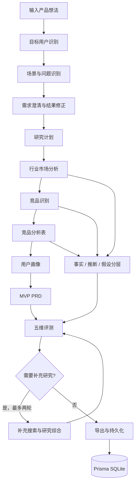

## 示例问题运行截图

示例问题：

> 我想做一个面向求职者的、根据岗位 JD 和个人简历生成个性化 HR 打招呼内容的 AI 工具。

### 1. 首页：输入产品想法

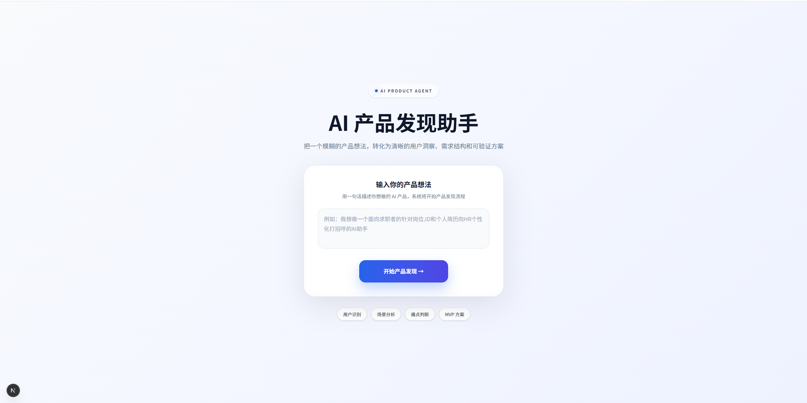

### 2. 目标用户识别

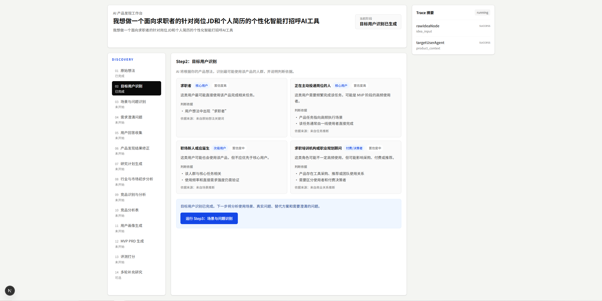

### 3. 场景与问题识别

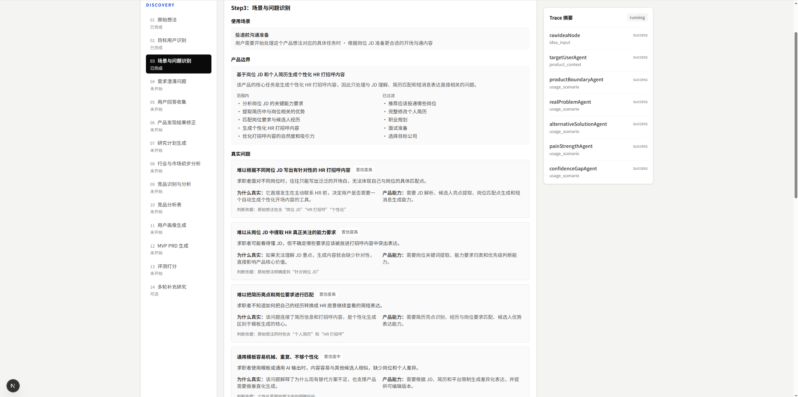

### 4. 需求澄清问题

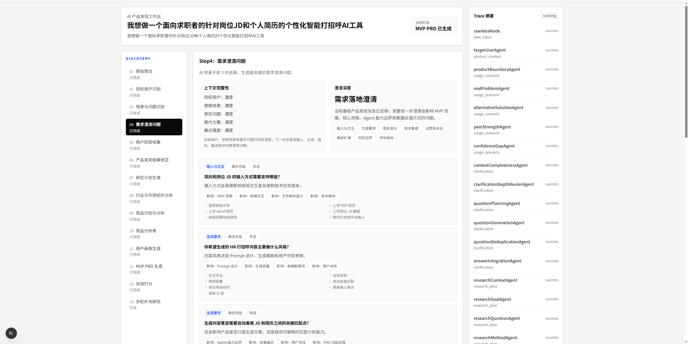

### 5. 用户回答收集

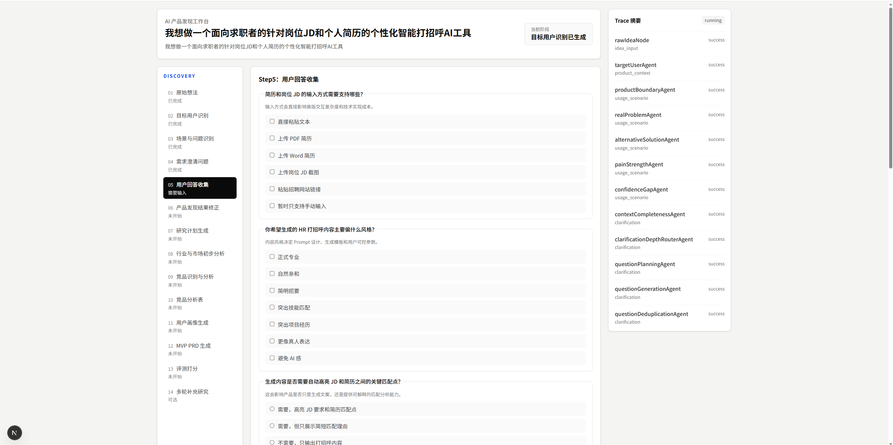

### 6. 产品发现结果修正

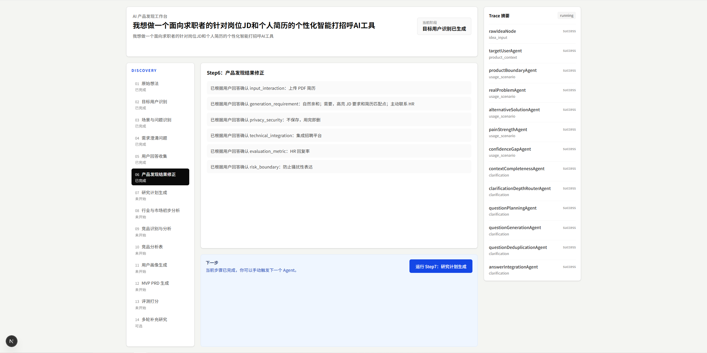

### 7. 研究计划生成

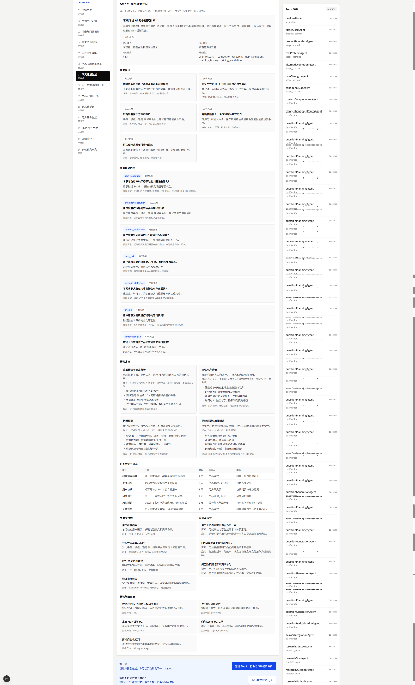

### 8. 行业与市场初步分析

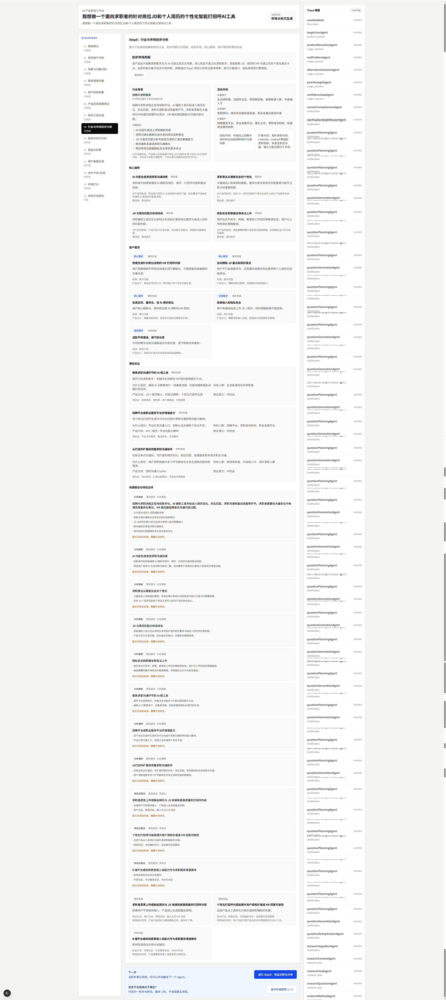

### 9. 竞品识别分析

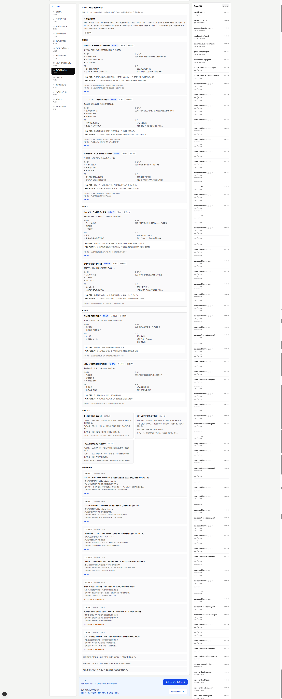

### 10. 竞品分析表

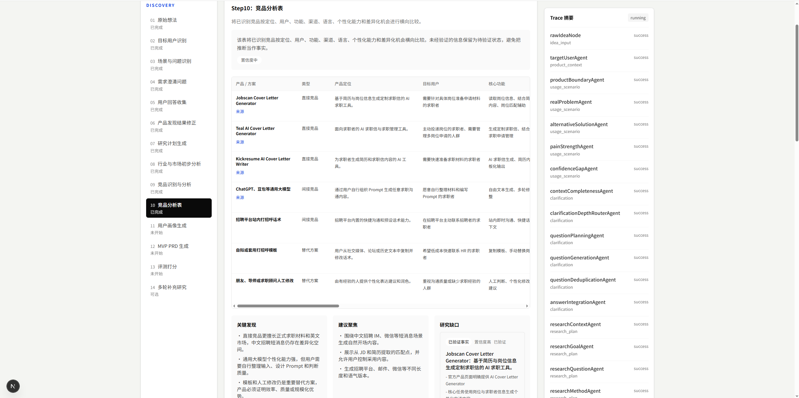

### 11. 用户画像生成

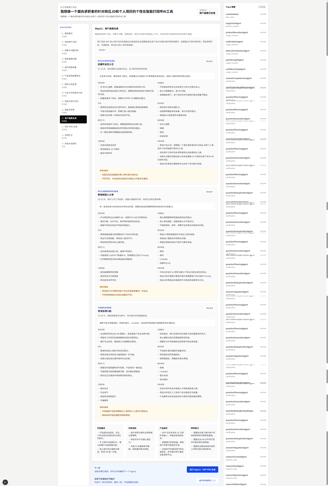

### 12. MVP PRD 生成

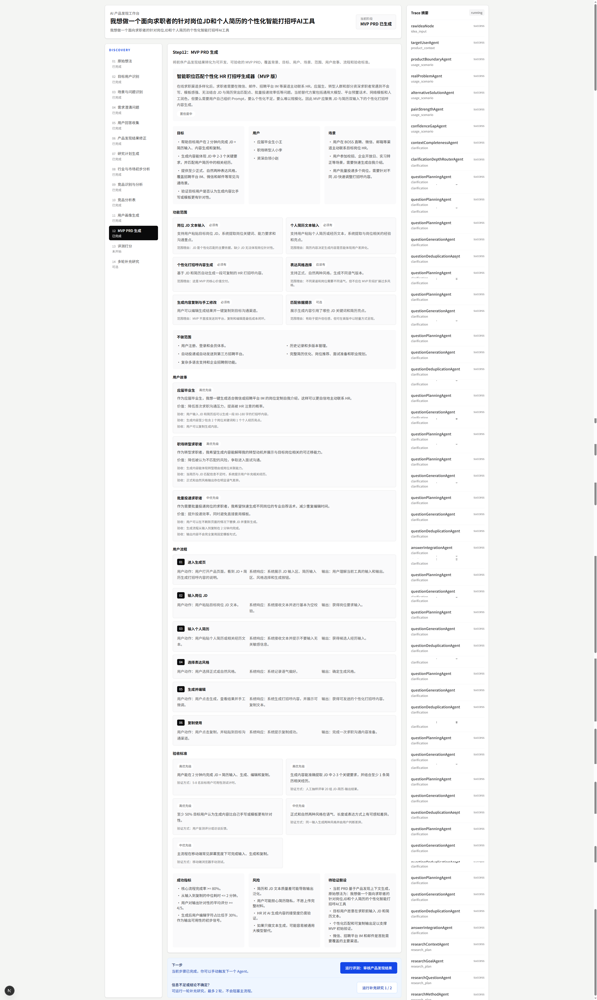

### 13. 评测打分

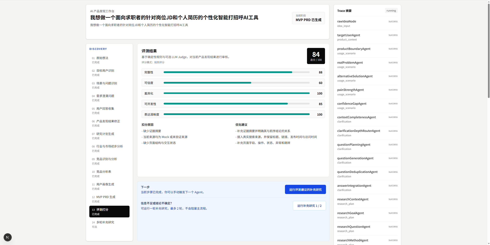

## 本地启动

```bash
npm install
npx prisma db push
npm run dev
```

访问：

```text
http://localhost:3000
```

Windows PowerShell 如果遇到 npm 脚本执行策略问题，可以使用：

```bash
npm.cmd run dev
```

## 环境变量

复制 `.env.example` 到 `.env`，按需修改：

```env
DATABASE_URL="file:./dev.db"

OPENAI_API_KEY=
OPENAI_MODEL_DEFAULT=
OPENAI_MODEL_EVAL=
USE_MOCK_LLM=true

DEEPSEEK_API_KEY=
DEEPSEEK_BASE_URL=https://api.deepseek.com
DEEPSEEK_MODEL_DEFAULT=deepseek-v4-flash
DEEPSEEK_MODEL_PRD=deepseek-v4-flash
DEEPSEEK_MODEL_EVAL=deepseek-v4-pro

USE_MOCK_SEARCH=true
SEARCH_API_KEY=
SEARCH_API_ENDPOINT=
```

说明：

- `DATABASE_URL`：本地 SQLite 数据库地址。
- `USE_MOCK_LLM=true`：默认使用 Mock LLM，不调用真实 OpenAI。
- `OPENAI_API_KEY`：只有在 `USE_MOCK_LLM=false` 且提供 API Key 时才会尝试真实 OpenAI 调用。
- `OPENAI_MODEL_DEFAULT`：默认模型名称。
- `OPENAI_MODEL_EVAL`：评测节点可使用的模型名称。
- `DEEPSEEK_API_KEY`：DeepSeek API Key，不应提交到仓库。
- `DEEPSEEK_BASE_URL`：DeepSeek API 基础地址。
- `DEEPSEEK_MODEL_DEFAULT` / `DEEPSEEK_MODEL_PRD` / `DEEPSEEK_MODEL_EVAL`：不同节点使用的 DeepSeek 模型。
- `USE_MOCK_SEARCH=true`：默认使用 Mock Search。
- `SEARCH_API_KEY` / `SEARCH_API_ENDPOINT`：Generic Search Provider 的通用配置，当前不绑定具体厂商。

## Demo 使用流程

### 方式 1：前端工作台

1. 打开 `http://localhost:3000`
2. 输入产品想法，或点击示例输入
3. 点击“开始产品发现”
4. 系统先运行目标用户识别并进入项目工作台
5. 在工作台中逐步触发场景分析、需求澄清、研究、竞品、画像、PRD 与评测
6. 在行业与竞品模块查看事实、推断和待验证假设
7. 当评测发现可信度或差异化不足时，按建议触发补充研究

### 方式 2：命令行 Demo

```bash
npm run demo:agent
npm run validate:evaluation
```

`demo:agent` 使用 Mock LLM 和 Mock Search 跑 Agent 状态机；`validate:evaluation` 验证五维评分和补充研究触发规则。

## 数据持久化

项目使用 Prisma + SQLite 保存：

- User
- Project
- AgentTask
- AgentStateSnapshot
- Artifact
- ArtifactVersion
- Source
- Evaluation
- TraceEvent
- FeedbackCase

当前使用 mock user，不包含登录系统。

## 作品集亮点

这个项目不是普通的 PRD 生成器。

它的重点是构建一个可扩展的产品发现 Agent 架构：

- 用 Agent State Machine 编排节点，而不是一次性 prompt。
- 每个节点读写统一 `AgentState`。
- 每个节点和工具调用都可以进入 Trace。
- Tool Registry 把搜索、导出、Mermaid 等能力与 Agent 编排解耦。
- Mock Provider 保证无 API Key 可运行，真实 Provider 通过接口逐步替换。
- 关键市场与竞品结论区分事实、推断和待验证假设，避免把模型判断直接当作事实。
- 五维评测会将可信度和差异化缺口反馈给多轮搜索，形成研究闭环。
- Prisma 持久化保存项目、任务、状态快照、生成物、版本、来源、评测和 Trace。

## Roadmap

- 完善真实 DeepSeek / OpenAI Provider 的生产级调用与回归评测
- 接真实 Search API，并完善来源质量评估
- 支持网页阅读与引用级证据追踪
- Figma 导出
- Codex 开发任务生成
- 团队协作
- 竞品持续监控
- Agent 运行 SSE 流式输出
- 更细粒度的 Artifact Version 对比

## 当前限制

- 默认不调用真实 OpenAI。
- 默认不调用真实搜索 API。
- Mock Search 结果不能代表真实市场事实。
- Mock 来源不会被标记为已验证事实；真实来源仍需人工审核或可靠来源验证。
- 当前没有登录系统，使用 mock user。
- 当前 Agent API 为同步返回，尚未实现 SSE。
