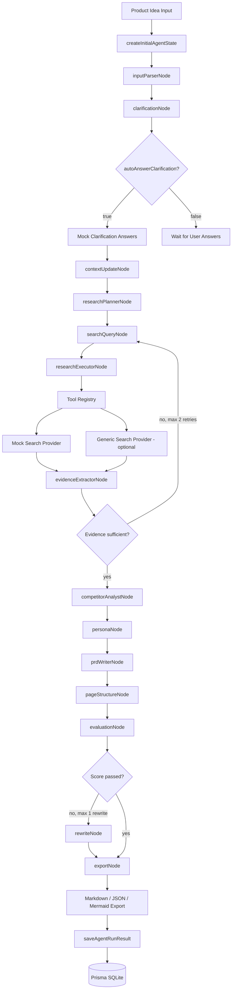

# AI Product Discover / 智研产品发现 Agent

AI Product Discover / 智研产品发现 Agent 是一个面向 AI 产品经理、创业者、独立开发者和咨询顾问的产品发现 MVP。

它的目标是把一个产品想法转化为结构化的产品发现结果：需求澄清、研究计划、竞品分析、用户画像、MVP PRD、页面结构、评测打分、Trace 和导出内容。

当前版本默认使用 Mock LLM 和 Mock Search，保证没有 API Key 也能本地跑通完整流程。真实 OpenAI Provider 和通用 Search Provider 的代码结构已经预留，但默认不启用。

## 核心功能

- 产品想法输入
- 需求澄清
- 研究计划
- Mock 搜索与证据摘要
- 竞品分析
- 用户画像
- MVP PRD
- 页面结构
- 评测打分
- Agent Trace
- Markdown / JSON / Mermaid 导出
- Prisma SQLite 持久化
- Artifact 与 Artifact Version 版本管理

## 技术架构

- Next.js App Router
- TypeScript
- Agent State Machine
- Mock LLM Provider
- OpenAI Provider 代码结构，默认关闭
- Tool Registry
- Mock Search Provider
- Generic Search Provider 代码结构，默认关闭
- Prisma + SQLite
- Zod Schema
- Agent Trace

## Agent 架构图



## 本地启动

```bash
npm install
npx prisma db push
npm run dev
```

访问：

```text
http://localhost:3000
```

Windows PowerShell 如果遇到 npm 脚本执行策略问题，可以使用：

```bash
npm.cmd run dev
```

## 环境变量

复制 `.env.example` 到 `.env`，按需修改：

```env
DATABASE_URL="file:./dev.db"

OPENAI_API_KEY=
OPENAI_MODEL_DEFAULT=
OPENAI_MODEL_EVAL=
USE_MOCK_LLM=true

USE_MOCK_SEARCH=true
SEARCH_API_KEY=
SEARCH_API_ENDPOINT=
```

说明：

- `DATABASE_URL`：本地 SQLite 数据库地址。
- `USE_MOCK_LLM=true`：默认使用 Mock LLM，不调用真实 OpenAI。
- `OPENAI_API_KEY`：只有在 `USE_MOCK_LLM=false` 且提供 API Key 时才会尝试真实 OpenAI 调用。
- `OPENAI_MODEL_DEFAULT`：默认模型名称。
- `OPENAI_MODEL_EVAL`：评测节点可使用的模型名称。
- `USE_MOCK_SEARCH=true`：默认使用 Mock Search。
- `SEARCH_API_KEY` / `SEARCH_API_ENDPOINT`：Generic Search Provider 的通用配置，当前不绑定具体厂商。

## Demo 使用流程

### 方式 1：前端工作台

1. 打开 `http://localhost:3000`
2. 输入产品想法，或点击示例输入
3. 点击“开始产品发现”
4. 系统会同步运行 Agent
5. 完成后进入项目工作台
6. 查看产品理解、澄清问题、研究计划、证据摘要、竞品分析、用户画像、MVP PRD、页面结构、评测结果和导出内容

### 方式 2：命令行 Demo

```bash
npm run demo:agent
```

该命令会使用 Mock LLM 和 Mock Search 跑完整 Agent 状态机，并在控制台输出 PRD、页面结构、评分和 Mermaid 页面流转图。

## 数据持久化

项目使用 Prisma + SQLite 保存：

- User
- Project
- AgentTask
- AgentStateSnapshot
- Artifact
- ArtifactVersion
- Source
- Evaluation
- TraceEvent
- FeedbackCase

当前使用 mock user，不包含登录系统。

## 作品集亮点

这个项目不是普通的 PRD 生成器。

它的重点是构建一个可扩展的产品发现 Agent 架构：

- 用 Agent State Machine 编排节点，而不是一次性 prompt。
- 每个节点读写统一 `AgentState`。
- 每个节点和工具调用都可以进入 Trace。
- Tool Registry 把搜索、导出、Mermaid 等能力与 Agent 编排解耦。
- Mock Provider 保证无 API Key 可运行，真实 Provider 通过接口逐步替换。
- 评测节点形成产品发现闭环，而不仅是生成文档。
- Prisma 持久化保存项目、任务、状态快照、生成物、版本、来源、评测和 Trace。

## Roadmap

- 接真实 OpenAI Provider，并让节点输出严格匹配 Zod Schema
- 接真实 Search API，并完善来源质量评估
- 支持网页阅读与引用级证据追踪
- Figma 导出
- Codex 开发任务生成
- 团队协作
- 竞品持续监控
- Agent 运行 SSE 流式输出
- 更细粒度的 Artifact Version 对比

## 当前限制

- 默认不调用真实 OpenAI。
- 默认不调用真实搜索 API。
- Mock Search 结果不能代表真实市场事实。
- 当前没有登录系统，使用 mock user。
- 当前 Agent API 为同步返回，尚未实现 SSE。
